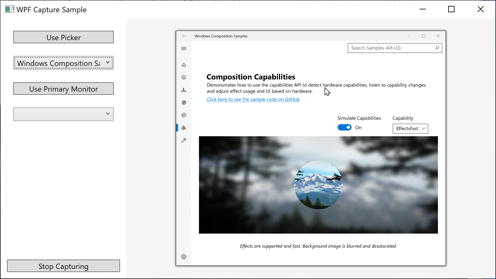

# epicro - Warcraft 3 게임 자동화 도구

Warcraft 3 전용 게임 자동화 및 보조 도구입니다.
Windows Graphics Capture API를 활용한 화면 캡처, OCR 기반 텍스트 인식, 메모리 직접 읽기 등 다양한 기능을 제공합니다.



---

## 주요 기능

- **화면 캡처 및 OCR 인식** - Windows.Graphics.Capture API + Tesseract OCR로 게임 화면의 텍스트(골드, 나무 등 자원) 실시간 인식
- **보스 소환 자동화** - 구역별 보스 이미지 매칭 및 소환 순서 자동 처리
- **벨트/인벤토리 매크로** - 키보드 입력 자동화를 통한 아이템 관리
- **게임 메모리 읽기/쓰기** - 골드, HP 등 게임 내 데이터 직접 접근
- **텔레그램 봇 알림** - 게임 이벤트 발생 시 텔레그램 채팅으로 알림 전송
- **전역 키보드 훅** - 시스템 전체 단축키 등록 및 처리
- **게임 패치 적용** - HP 표시, 채팅 색상, 카메라 설정 등 커스터마이징
- **WC3 세이브 파일 파싱** - 게임 저장 파일 분석 및 통계 추적

### 지원 보스 구역

| 구역 | 설명 |
|------|------|
| 유적지 | Zone 1 |
| 해역 | Zone 2 |
| 태엽 | Zone 3 |
| 키사메 | Zone 4 |
| 키미 | Zone 5 |
| 데달 | Zone 6 |
| 유기토 | Zone 7 |
| 우타 | Zone 8 |
| 사성수 | Zone 9 |

---

## 프로젝트 구조

```
ScreenCapture/
├── epicro/                              # 메인 WPF 애플리케이션
│   ├── Helpers/                         # 유틸리티 클래스
│   │   ├── OcrService.cs                # OCR 텍스트 인식
│   │   ├── BossMatcher.cs               # 보스 이미지 매칭
│   │   ├── GoldMemoryReader.cs          # 게임 메모리 읽기
│   │   ├── TelegramBotService.cs        # 텔레그램 알림
│   │   ├── InputHelper.cs               # 키보드/마우스 입력
│   │   ├── SettingsManager.cs           # JSON 설정 관리
│   │   ├── ProcessMemoryWatcher.cs      # 프로세스 모니터링
│   │   ├── NativeMethods.cs             # Windows API P/Invoke
│   │   └── SaveFileParser.cs            # 세이브 파일 파서
│   ├── Logic/                           # 핵심 자동화 로직
│   │   ├── BossSummonerWpf.cs           # 보스 소환 자동화
│   │   └── BeltMacro.cs                 # 벨트 매크로
│   ├── Models/                          # 데이터 모델
│   │   ├── AppSettings.cs               # 설정 스키마
│   │   ├── BossConfig.cs                # 보스 정의
│   │   ├── BossStats.cs                 # 통계 추적
│   │   └── ItemMixConfig.cs
│   ├── Wc3/                             # Warcraft 3 연동
│   │   ├── Memory/                      # 게임 메모리 구조체
│   │   ├── Worker/                      # 자동화 워커
│   │   ├── KeyHook/                     # 키보드 훅
│   │   └── Wc3Globals.cs
│   ├── MainWindow.xaml(.cs)             # 메인 UI
│   ├── BossSetting.xaml(.cs)            # 보스 설정 UI
│   ├── OcrSettingWindow.xaml(.cs)       # OCR 설정 UI
│   └── RpgSettingWindow.xaml(.cs)       # RPG 설정 UI
├── CaptureSampleCore/                   # 화면 캡처 라이브러리
├── Composition.WindowsRuntimeHelpers/   # Windows Runtime 인터롭
└── epicro.sln                           # 솔루션 파일
```

---

## 실행 환경

- **OS:** Windows 10 버전 1903 이상 (Windows 11 권장)
- **런타임:** .NET Framework 4.7.2 이상
- **SDK:** Windows 10 SDK 18362 이상
- **개발 도구:** Visual Studio 2017 이상

> **참고:** 최소화된 창은 목록에 표시되지만 캡처되지 않습니다.

---

## 빌드 방법

1. **Visual Studio**에서 `epicro.sln` 열기
2. **빌드 > 솔루션 빌드** 실행 (또는 `Ctrl+Shift+B`)
3. 빌드 결과물: `epicro\bin\[Debug|Release]\epicro.exe`

```bash
# CLI 빌드 (선택 사항)
dotnet build epicro.sln
```

---

## 설정 파일 (settings.json)

실행 파일과 같은 폴더에 `settings.json`이 자동 생성됩니다.

### 주요 설정 항목

| 카테고리 | 설정 키 | 설명 |
|----------|---------|------|
| **화면 인식** | `Roi_Gold`, `Roi_Tree` | 자원 감지 영역 좌표 |
| | `Roi_Q`, `Roi_W`, `Roi_E`, `Roi_R`, `Roi_A` | 스킬 감지 영역 |
| **보스 자동화** | `BossZone`, `BossOrder`, `SelectedROI` | 보스 구역 및 순서 설정 |
| | `ResourceDetectionMode` | 자원 감지 방식 (OCR / 메모리) |
| **캐릭터** | `HeroNum`, `BagNum`, `BeltNum`, `BeltSpeed` | 캐릭터 및 인벤토리 설정 |
| **OCR** | 색상 필터 (3색), 배경색 | 텍스트 인식 색상 범위 |
| **텔레그램** | `TelegramBotToken`, `TelegramChatIds`, `TelegramEnabled` | 알림 봇 설정 |
| **게임 패치** | HP 표시, 채팅 색상, 카메라, 딜레이 | WC3 커스터마이징 |
| **자동화** | `AutoRG`, 매크로 단축키, 채팅 단축키 | 자동화 동작 설정 |

---

## 의존성 (NuGet 패키지)

| 패키지 | 버전 | 용도 |
|--------|------|------|
| OpenCvSharp4 | 4.10.0 | 이미지 처리 및 보스 매칭 |
| Tesseract | 5.2.0 | OCR 텍스트 인식 |
| Newtonsoft.Json | 13.0.3 | 설정 파일 직렬화 |
| SharpDX.Direct3D11 | 4.2.0 | Direct3D 11 그래픽 |
| Microsoft.Windows.SDK.Contracts | 10.0.22621.2 | Windows Runtime API |
| System.Drawing.Common | 9.0.3 | 비트맵/그래픽 처리 |

---

## 기술 세부 사항

- **멀티스레드 처리:** 캡처, OCR, 게임 자동화 워커 각각 독립 스레드 운용
- **Windows Interop:** P/Invoke를 통한 창 열거, 입력 시뮬레이션
- **메모리 직접 접근:** Warcraft 3 프로세스 메모리 읽기/쓰기
- **TGA 이미지 지원:** WC3 네이티브 이미지 포맷 파싱
- **Windows.Graphics.Capture:** `CreateForWindow` (HWND) 및 `CreateForMonitor` (HMON) API 활용

---

## 참고 자료

- [Windows.Graphics.Capture Namespace](https://docs.microsoft.com/uwp/api/windows.graphics.capture)
- [Windows.UI.Composition Win32 Samples](https://github.com/Microsoft/Windows.UI.Composition-Win32-Samples)
- [Windows 10 SDK 다운로드](https://developer.microsoft.com/windows/downloads/windows-10-sdk)
